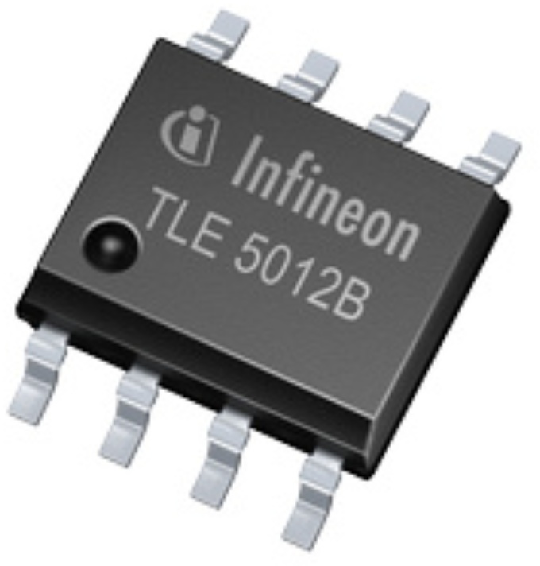
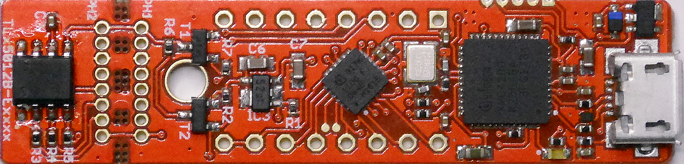

# XENSIV™ TLx5012B Angle Sensor

Library of Infineon's highly sensitive [XENSIV™ TLx5012B](https://www.infineon.com/cms/en/product/sensor/magnetic-sensors/magnetic-position-sensors/angle-sensors) 360° magnetic angle sensor.

### Suported Products

|  |  |  |
|:--:|:--:|:--:|
| *bulk sensor* | *breakout board* | *Sensor2Go kit* 

This library supports also all predefined communication variants IIF, PWM, SPC. All of these variants also support the SSC interface.

### Supported Frameworks

<table>
    <tr>
        <td></td>
        <td></td>
    </tr>
    <tr>
        <td style="text-align: center"><a href="https://github.com/Infineon/TLE5012-Magnetic-Angle-Sensor/wiki/Arduino-API">Arduino API</a></td>
        <td style="text-align: center"><a href="https://github.com/Infineon/TLE5012-Magnetic-Angle-Sensor/wiki/TLE5012B-API/">TLE5012B API</a> <a href="https://github.com/Infineon/TLE5012-Magnetic-Angle-Sensor/wiki/TLE5012BMotor-API">TLx5012B Register API</a></td>
    </tr>
    <tr>
        <td style="text-align: center"><a href="https://github.com/Infineon/TLE5012-Magnetic-Angle-Sensor/wiki/Ino-Getting-Started">Getting Started</a></td>
        <td style="text-align: center"><a href="https://github.com/Infineon/TLE5012-Magnetic-Angle-Sensor/wiki/Porting-Guide">Porting Guide</a></td>
    </tr>
</table>

## Summary
The [TLE5012B](https://www.infineon.com/cms/en/product/evaluation-boards/tle5012b_e1000_ms2go/) is a 360° angle sensor that detects the orientation of a magnetic field. This is achieved by measuring sine and cosine angle components with monolithic integrated Giant Magneto Resistance (iGMR) elements. These raw signals (sine and cosine) are digitally processed internally to calculate the angle orientation of the magnetic field (magnet). The TLx5012B is a pre-calibrated sensor. The calibration parameters are stored in laser fuses. At start-up the values of the fuses are written into flip-flops, where these values can be changed by the application-specific parameters. Further precision of the angle measurement over a wide temperature range and a long lifetime can be improved by enabling an optional internal auto calibration algorithm. Data communications are accomplished with a bi-directional Synchronous Serial Communication (SSC) that is SPI-compatible. The sensor configuration is stored in registers, which are accessible by the SSC interface. Additionally four other interfaces are available with the TLx5012B: Pulse-Width-Modulation (PWM) Protocol, Short-PWM-Code (SPC) Protocol, Hall Switch Mode (HSM) and Incremental Interface (IIF). These interfaces can be used in parallel with SSC or alone. Pre-configured sensor derivate with different interface settings are available.

## Key Features and Benefits
* Giant Magneto Resistance (GMR)-based principle
* Integrated magnetic field sensing for angle measurement
* 360° angle measurement with revolution counter and angle speed measurement
* Two separate highly accurate single bit SD-ADC
* 15 bit representation of absolute angle value on the output (resolution of 0.01°)
* 16 bit representation of sine / cosine values on the interface
* Max. 1.0° angle error over lifetime and temperature-range with activated auto-calibration
* Bi-directional SSC Interface up to 8 Mbit/s
* Interfaces: SSC, PWM, Incremental Interface (IIF), Hall Switch Mode (HSM), Short PWM Code (SPC, based on SENT protocol defined in SAE J2716)
* Output pins can be configured (programmed or pre-configured) as push-pull or open-drain
* Bus mode operation of multiple sensors on one line is possible with SSC or SPC interface

## More information
The complete documentation of the library as well as detailed information about the XENSIV™ TLx5012B Angle Sensor, can be found [here](https://xensiv-angle-sensor-tlx5012.readthedocs.io/en/latest/index.html).

## License

This project is licensed under the MIT License - see the [LICENSE](LICENSE) file for details.
