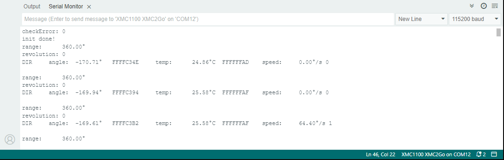

.. _example-E9000SPC:

Example to read the E9000 Sensor
--------------------------------

The TLE5012B-E9000 with SPC interface does not automatically start the DSP in a loop at startup. It will need a certain trigger on the IFA pin of the sensor.
This trigger must occur within a 90 UT (unit time) frame and be at least 12 UT long for the first sensor. By multiplying the 12 UT with the sensor slave number, up to four sensors can be triggered.
The trigger setting UT (unit time) must be multiplied by the sensor's base unit time, which is 3.0 µs by default. Setting the IFA pin to low and waiting at least the total trigger time
will configure all registers via the DSP. For more information, please read the SPC Interface section of the `TLE5012B manual`_ .
The default setup is:

* UT (unit time) = 3.0 µs,
* total trigger time = 90 * 3.0 µs = 270 µs,
* t_mlow (time for the first sensor to trigger) = 12 * 3.0 µs = 36 µs

so we have to set the IFA pin to low for 36 µs, then back to high and wait (90-12) * 3.0 µs = 224 µs.

This example is similar to :doc:`example-readAngleTest`, but with a different sensor trigger.

Setup
'''''
* Connect the sensor to the hardware platform, in this case it should be a TLE5012B E9000 2GO Kit with the SPC interface.
* Connect the hardware platform to the PC.
* Open the Arduino IDE.
* Open the serial monitor.
* Select the correct serial port.
* Select the correct baud rate (115200).
* Place a magnet close to the sensor to get a valid angle value.

Expected Output
'''''''''''''''

* The angle, range, revolution and temperature is read and printed to the serial monitor.
* The values are updated in every loop iteration after triggering the IFA pin.
* The angle and range values are provided in degrees, the revolutions in full revolution count and the temperature in degree Celsius.

Additional Information
''''''''''''''''''''''

The TLx5012B sensors are not marked on chip for the sensor type. So sometimes it is necessary to read the sensor type from the registers.
Use the :ref:`example-sensorType` or the :ref:`example-sensorRegisters` example to read the sensor type and the sensor registers.
The TLE5012B-E9000 with SPC interface is always in sleep mode until you trigger the sensor with the IFA pin as demonstrated in this example.

However, you can reprogram the sensor interface to a different sensor type as explained in the :doc:`example-writeRegisters` example. 
After that the sensor will work constantly as any other one, but a firmware reset or a power cycle will set the sensor back to its original 
interface and it has to be reprogrammed again.

|

.. _`TLE5012B manual`: https://www.infineon.com/dgdl/Infineon-Angle_Sensor_TLE5012B-UM-v01_02-en-UM-v01_02-EN.pdf?fileId=5546d46146d18cb40146ec2eeae4633b

