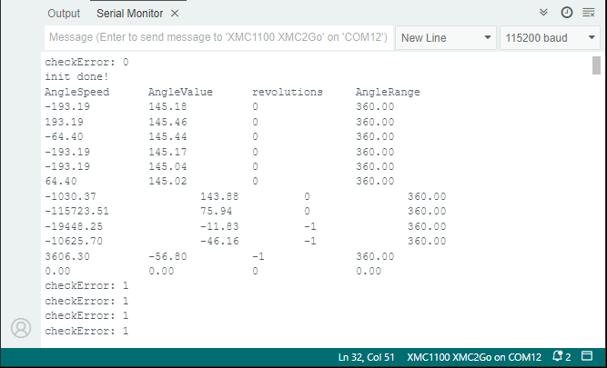

.. _example-readAngleSpeedRevolutions:

Example to read the Angle, Speed, and Revolutions
--------------------------------------------------

This example demonstrates the possible readout of the angle, angle speed and number of revolutions at once.

Setup
'''''
* Connect the sensor to the hardware platform.
* Connect the hardware platform to the PC.
* Open the Arduino IDE.
* Open the serial monitor.
* Select the correct serial port.
* Select the correct baud rate (115200).
* Place a magnet close to the sensor to get a valid angle value.

Expected Output
''''''''''''''''

* The angle, speed, range and revolutions are read and printed to the serial monitor.
* The values are updated in every loop iteration.
* The angle is printed in degrees, the speed in degrees per second and the revolutions in full revolutions.
* The sensor CRC is checked and the values are only printed if the CRC is correct.
* The range is set to a full 360° setting.

Additional Information
''''''''''''''''''''''

This example can be used as a starting point, fetching speed and angle values only when a magnetic field is detected.
During the loop function the sensor checkError will be constantly checked and only if a magnetic field is present the angle, speed and revolutions 
will be printed to the serial monitor. If you remove the magnet from the sensor the sensor checkError will be 1 and no values will be printed
and it will start printing again if you place the magnet back to the sensor.

* The sensor checkError, which should be 0 if a magnetic field is present or 1 if no magnetic field is present.
* The speed value in degrees per second (be aware that the speed value is internally calculated and can be noisy).
* The actual angle value in degrees from -180° to 180°, so if you need the angle value from0-360° you have to add 180° to the value.
* The actual angle range which is set to a full 360° setting. You can reduce the angle range to 180° or  90°.
* The number of full revolutions of the magnetic field, so for an absolute angle value, you have to multiply the revolutions with 360° and add the angle value.

Try to move a magnet close to the sensor or remove it from the sensor and see the values changing.
Also try to turn the magnet in front of the sensor and see the angle speed, value and revolutions changing.

|