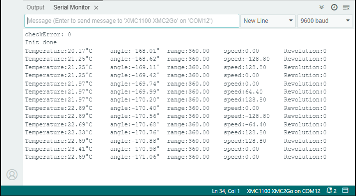

.. _example-readAngleTest:

Example to read the Angle
-------------------------

This example reads all main sensor registers (angle, revolution, speed, range, and temperature) for a simple first test of the sensor and communication.

Setup
'''''

* Connect the sensor to the hardware platform.
* Connect the hardware platform to the PC.
* Open the Arduino IDE.
* Open the serial monitor.
* Select the correct serial port.
* Select the correct baud rate (9600).
* Place a magnet close to the sensor to get a valid angle value.

Expected Output
''''''''''''''''

* The angle, range, revolution and temperature is read and printed to the serial monitor.
* The angle is in degrees, the range in degrees, the revolutions in full revolutions and the temperature in degree Celsius.

Additional Information
''''''''''''''''''''''

This example can be used to check the sensor and the communication. The sensor will print out the following values:

* The sensor checkError, which should be 0 if a magnetic field is present or 1 if no magnetic field is present.
* The sensor temperature value which is used to correct the temperature drift of the sensor. This is not the ambient temperature it is the temperature of the sensor itself.
* The actual angle value in degrees from -180° to 180°, so if you need the angle value from0-360° you have to add 180° to the value.
* The actual angle range which is set to a full 360° setting. You can reduce the angle range to 180° or  90°.
* The speed value in degrees per second (be aware that the speed value is internally calculated and can be noisy).
* The number of full revolutions of the magnetic field, so for an absolute angle value, you have to multiply the revolutions with 360° and add the angle value.

For this type of measurement a magnet is needed to get valid angle values but it must not be present from the 
very begining of the program. The sensor will detect the magnetic field as soon as there is one and will start to measure the angle value.

|
