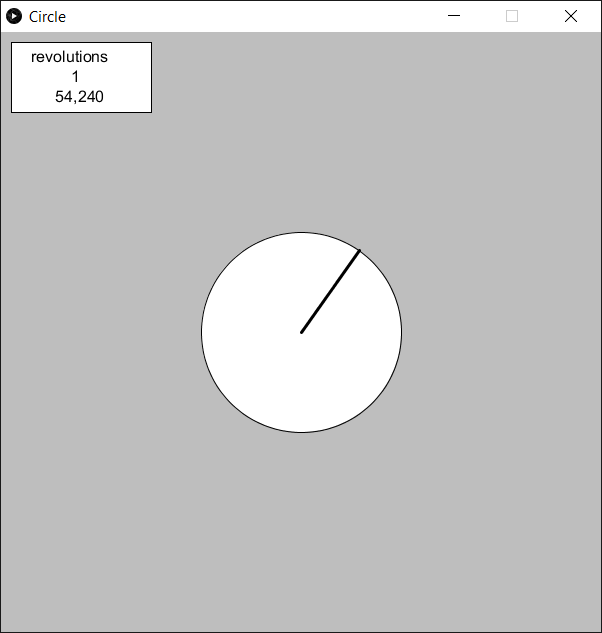
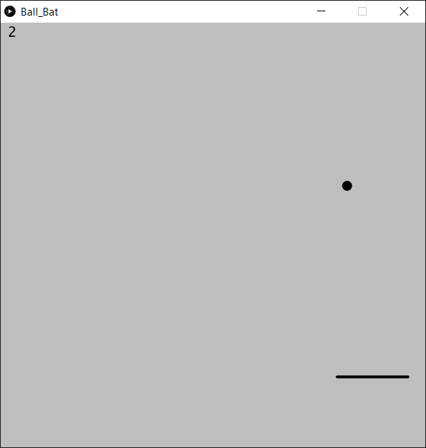
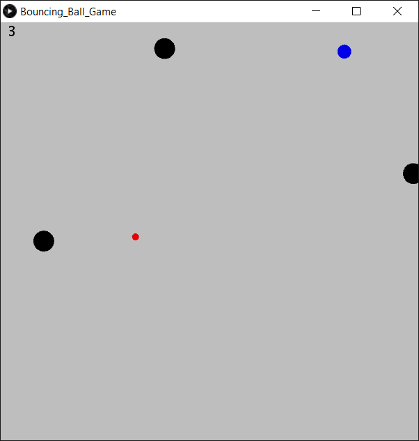
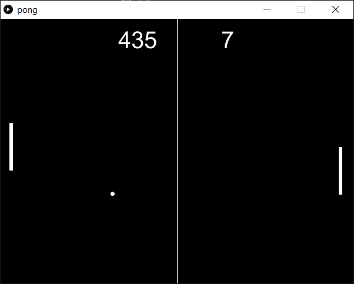
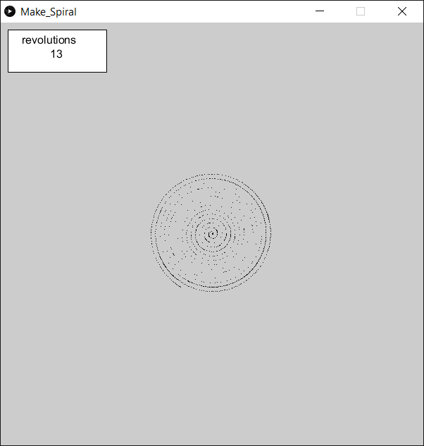
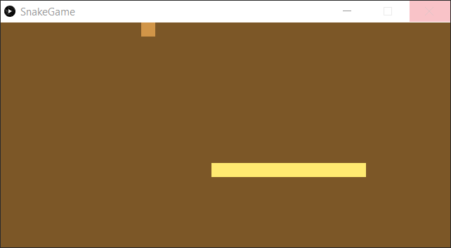
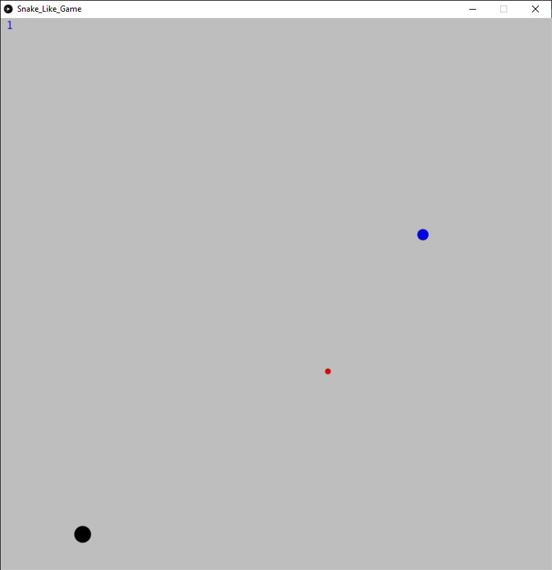

.. _example-readAngleValueProcessing:

Example to read the Angle and process the Value
------------------------------------------------

This is a fast running example to demonstrate the possible readout speed of the sensor for the angle. Depending on your microcontroller more or less speed on the serial port is possible.

.. note::
This program can be used together with the `Processing`_ examples to visualize the angle value.

* We use a maximum baud rate setting of 1000000 baud.
* Default delay is 10 ms in the loop. You can play with smaller values in the delay to get a faster readout speed, but be aware that your Serial interface can be overloaded.

* We use a maximum baud rate setting of 1000000 baud.
* Default delay is 10 ms in the loop. You can play with smaller values in the delay to get a faster readout speed, but be aware that your Serial interface can be overloaded.

Setup
'''''

* Connect the sensor to the hardware platform.
* Connect the hardware platform to the PC.
* Open the Arduino IDE.
* Open the serial monitor.
* Select the correct serials port.
* Select the correct baud rate (1000000).
* Place a magnet close to the sensor to get a valid angle value.

Expected Output
''''''''''''''''

* The angle is read and printed to the serial monitor in every loop iteration with highest possible and stable speed.

Additional Information
''''''''''''''''''''''

This example can ideally be used with an oscilloscope to visualize the SPI communication signals or to check the signal quality.

There are some `Processing`_ examples which are using the angle value to visualize it. Therefore you need one of the `TLE5012B E1xxx 2GO Kits`_
(not the one with SPC interface) and a rotary knob to change the angle value. Also check before:

* The `Processing`_ examples need the correct baud rate, some are running with 9600 baud and some with 1000000 baud. Check this before and set it manually in the Processing/Arduino sketch.
* The `Processing`_ examples need the correct serial port, check this also before and set it manually in the portName variable in the Processing sketch.
* The Arduino serial monitor or any other communication to that serial port should be closed before starting the `Processing`_ sketch.

Circle
""""""

* Needs a 1000000 baud rate and the correct serial port.
* Turn the knob to change the angle value.
* The angle value is used to draw a circle gauge.

|

Ball_Bat
""""""""

* Needs a 9600 baud rate and the correct serial port.
* Turn the knob to move the paddle left and right.

|

Bouncing_Ball
"""""""""""""

* Needs a 1000000 baud rate and the correct serial port.
* Turn the knob to move your ball.
* Push the blue ball with your red one to start the game, then avoid a collision with the moving black balls.
* Collect the blue balls to get points.
* With each collected blue ball the speed of and the number of the black balls increases.

|

Pong
""""

* Needs a 1000000 baud rate and the correct serial port.
* Turn the knob to move the paddle up and down.
* It is the classic pong game.

|

Make Spiral
"""""""""""

* Needs a 1000000 baud rate and the correct serial port.
* Turn the knob to change the angle value and the revolution value.
* Each revolution the spiral gets bigger.
* The curve density depends on the angle speed.

|

Snake
"""""

* Needs a 1000000 baud rate and the correct serial port.
* Turn the knob to move the snake.
* Avoid the walls and the snake itself.
* Prints the angle value to the console.

|

Snake Like
""""""""""

* Needs a 9600 baud rate and the correct serial port.
* Turn the knob to move the snake.
* Start the game by hitting the blue ball.
* Each time you hit the blue ball the number and speed of the black balls increases.
* Collect the blue balls to get points.
* Avoid the black balls.

|

.. _`TLE5012B E1xxx 2GO Kits`: https://www.infineon.com/cms/en/product/promopages/sensors-2go/#angle-sensor-2go
.. _`Processing`: https://processing.org/

