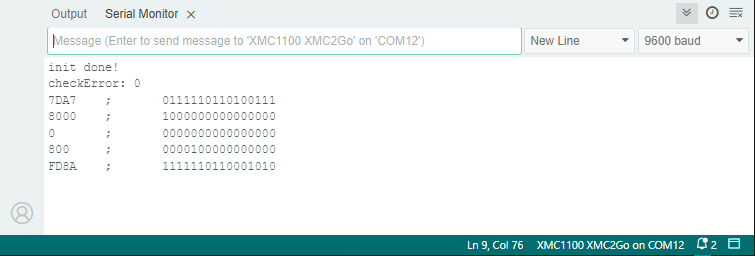

.. _example-readMultipleRegisters:

Example to read multiple Registers
----------------------------------

This example demonstrates how to read multiple raw registers at once. In this case you have to derive values like angle, angle speed etc. from the register contents by yourself.

The read command offset of 0x8000 will be set by the readMoreRegisters command so we need only the register offset from where we start and
the second digit tells us how many consecutive registers to read which is be done by adding the length and the command values.
A max of 15 values can read at once, one additional value is reserved for the safety bit. We only read the registers if checkError is false.
Therefore a magnet must be near the sensor, otherwise it will not work.

Setup
'''''

* Connect the sensor to the hardware platform.
* Connect the hardware platform to the PC.
* Open the Arduino IDE.
* Open the serial monitor.
* Select the correct serial port.
* Select the correct baud rate (9600).
* Place a magnet close to the sensor to get a valid angle value.

Expected Output
''''''''''''''''

* The raw values of the registers are read and printed to the serial monitor.
* The values are updated once.
* You can play with the offset and length values to see the effect on the raw values.
* You can play with the UPD_low/UPD_high values to see the effect on the raw values.
* You can play with the SAFE_low/SAFE_high values to see the effect on the raw values.

Additional Information
''''''''''''''''''''''

The TLx5012B uses a DSP with multiple registers for various kinds of data, like angle, angle speed, temperature, etc. or for setting the sensor
correction functions and interfaces. This example demonstrates how to read multiple raw registers at once (up to 15 values but here only 5 registers are used) and how to recalculate
and print them as binary code using the internal PRINTBIN function. The values are printed only if the sensor's checkError is false, indicating that a magnetic field is present, 
and they are printed only once. For more details about the sensor registers and their values, refer to the `TLE5012B manual`_.
The UPD_high/low flag is used to fill snapshot register, see also :ref:`example-snapshotSensorValues` and the SAFE_high/low flag is used to read/or not read the safety word.

|

.. _`TLE5012B manual`: https://www.infineon.com/dgdl/Infineon-Angle_Sensor_TLE5012B-UM-v01_02-en-UM-v01_02-EN.pdf?fileId=5546d46146d18cb40146ec2eeae4633b

