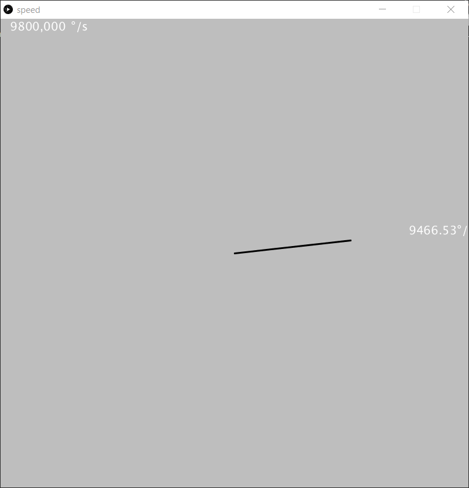

.. _example-readSpeedProcessing:

Example to read the Speed
--------------------------

This is a fast running example to demonstrate the possible readout speed of the sensor for the angle speed. Depending on your microcontroller more or less speed on the serial port is possible.

.. note::
  This program can be used together with the Processing examples to visualize the angle speed value.

 * We use a maximum baud rate setting of 1000000.
 * Default delay is 10 ms in the loop. You can play with smaller values in the delay to get a faster readout speed, but be aware that your Serial interface can be overloaded.

Setup
'''''

* Connect the sensor to the hardware platform.
* Connect the hardware platform to the PC.
* Open the Arduino IDE.
* Open the serial monitor.
* Select the correct serial port.
* Select the correct baud rate (1000000).
* Place a magnet close to the sensor to get a valid angle value.

Expected Output
''''''''''''''''

* The angle speed is read and printed to the serial monitor in every loop iteration with highest possible and stable speed.

Additional Information
''''''''''''''''''''''

This example can ideally be used with an oscilloscope to visualize the SPI communication signals or to check the signal quality.

There is one `Processing`_ example which is using the angle speed value to visualize it. Therefore you need one of the `TLE5012B E1xxx 2GO Kits`_
and a rotary knob to change the angle value. Also check before:

* The `Processing`_ examples need the correct baud rate, some are running with 9600 baud and some with 1000000 baud. Check this before and set it manually in the Processing/Arduino sketch.
* The `Processing`_ examples need the correct serial port, check this also before and set it manually in the portName variable in the Processing sketch.
* The Arduino serial monitor or any other communication to that serial port should be closed before starting the `Processing`_ sketch.

Speed
"""""

* Needs 100000 baud rate and the correct serial port.
* Turn the knob to change the angle speed.

|

.. _`Processing`: https://processing.org/

