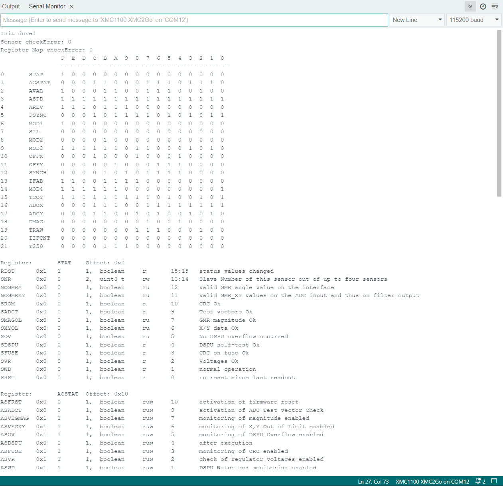

.. _example-sensorRegisters:

Example to read the Sensor Registers
------------------------------------

This example program will printout all documented registers from the sensor and writes this to the serial port with remark infos for each register.
Please have look at the sensor `TLE5012B manual`_ for more detailed information about each register.

.. note::
    This Sketch needs about 35 kB of memory and does not compile on the original Arduino Uno. Use the sensorType.ino instead.

.. note::
    This program includes a local const.c file with the serial output text.

Setup
'''''

* Connect the sensor to the hardware platform.
* Connect the hardware platform to the PC.
* Open the Arduino IDE.
* Open the serial monitor.
* Select the correct serial port.
* Select the correct baud rate (115200).
* Place a magnet close to the sensor to get a valid angle value.

Expected Output
''''''''''''''''

* A long list of register values with remark infos for each register.
* A bit matrix of all registers.
* The output is in a human readable format.
* The output does not loop and stops after the last register.

Additional Information
''''''''''''''''''''''

This example demonstrates how to use each of the sensor registers and register functions.

|

.. _`TLE5012B manual`: https://www.infineon.com/dgdl/Infineon-Angle_Sensor_TLE5012B-UM-v01_02-en-UM-v01_02-EN.pdf?fileId=5546d46146d18cb40146ec2eeae4633b
