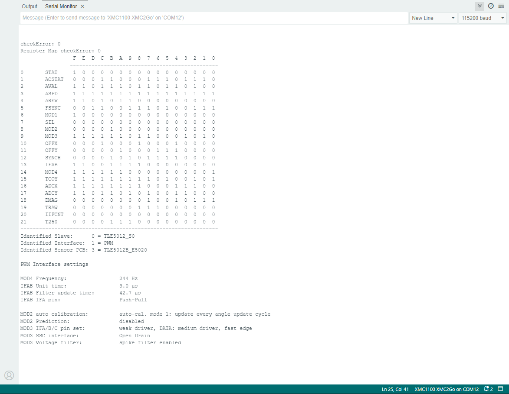

.. _example-sensorType:

Example to read the Sensor Type
-------------------------------

This example can be used to check the sensor type, sensor registers and main functions. It will print out the full bit code register map for
all 21 registers, the sensor type, the interface type and slave setting as well as some additional information.
From special registers MOD1,2,3,4 and IFAB the explicit sensor interface set and the PCB board name will be identified. See the Sensor `TLE5012B manual`_ for further
information on the different interfaces and the different sensor boards.

.. note::
    By additionally removing the remarks on certain write functions, some sensor setups can be set/unset or switched on/off.
    This demonstrates how to change the sensor interface as well as how to set certain sensor registers.

.. note::
    This program includes a local const.c file with the serial output text.

.. note::
    This Sketch might not work on an original Arduino Uno due to heavy memory usage.

Setup
'''''

* Connect the sensor to the hardware platform.
* Connect the hardware platform to the PC.
* Open the Arduino IDE.
* Open the serial monitor.
* Select the correct serial port.
* Select the correct baud rate (115200).

Expected Output
''''''''''''''''

* A long list of register values with remark info for each register.
* A bit matrix of all registers.
* The output is in a human readable format.
* The output does not loop and stops after the last register.
* Prints out the predefined sensor type and the sensor interface settings.

Additional Information
''''''''''''''''''''''

This example demonstrates how to print out the bit code setting of each register (see the show_bin function in the code). It also
demonstrates how to decide which sensor type is used and which interface is set by using the getInterfaceMode() method as well as
the actual set slave number with the getSlaveNumber method. The sensor type is printed out in a human readable format.

The printed results of the registers MOD1,2,3,4 and IFAB define the most important functions of each sensor interface, which are:

* PWM
    - PWM frequency setting
    - PWM duty cycle setting
    - PWM filter setting
* IIF
    - IIF mode setting
    - IIF resolution setting
    - IIF hysteresis setting
    - IIF filter setting
* HSM
    - HSM frame setting
    - HSM hysteresis setting
    - HSM filter setting
* SPC
    - SPC frame setting
    - SPC hysteresis setting
    - SPC trigger setting

and for all interfaces the push-pull or open-drain setting are printed.

|

.. _`TLE5012B manual`: https://www.infineon.com/dgdl/Infineon-Angle_Sensor_TLE5012B-UM-v01_02-en-UM-v01_02-EN.pdf?fileId=5546d46146d18cb40146ec2eeae4633b
