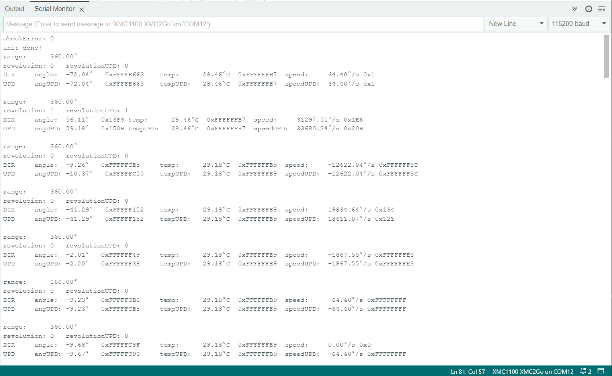

.. _example-snapshotSensorValues:

Example to snapshot Sensor Values
---------------------------------

This example will generate a looped output of the direct measured data (DIR) and data from the snapshot (UPD) registers. Therefore it demonstrates also the use of
the direct read (without UPD) and read after a trigger signal is send (with UPD). See sensor `TLE5012B manual`_ for more information on the UPD mode and the snapshot registers.
Running the update trigger before reading a value guarantees that all values are actual measurements.
Using the UPD flag will read all values into the snapshot before reading them, so that all values come from the same measurement.

Setup
'''''

* Connect the sensor to the hardware platform.
* Connect the hardware platform to the PC.
* Open the Arduino IDE.
* Open the serial monitor.
* Select the correct serial port.
* Select the correct baud rate (115200).
* Place a magnet close to the sensor to get a valid angle value.

Expected Output
''''''''''''''''

* The angle, revolution, speed and temperature values are read and printed to the serial monitor in every loop iteration.
* The values are printed either as raw values (what is written in the register) or as snapshot values after an update trigger.
* The output of raw and snapshot values can differ if the sensor is in motion.

Additional Information
''''''''''''''''''''''
This example demonstrates how to use the UPD (update) flag of certain registers of the TLx5012B sensor DSP. The UPD flag will read all values into the 
snapshot before transferring them to the SSC interface, so that all values come from the same measurement. This is useful if you want to read angle, speed
and revolution values at the same time. To use this option, you have to:

* Run a triggerUpdate which tells the sensor to collect new values and write them into the snapshot registers.
* Use the UPD flag High to read the values from the snapshot registers.

This can be done only on certain registers, see the `TLE5012B manual`_ for more information. 

The example also demonstrates the difference between the direct read (DIR) and the snapshot read (UPD) of the sensor values if you move the magnetic field
during the measurement the DIR and UPD values can differ. If you stop the movement, the values will be the same again.

The snapshot feature is part of Infineon's PRO-SIL™ features which are described in the `TLE5012B manual`_.

|

The `XENSIV™ TLx5012B`_ sensor is using Infineon's PRO-SIL™ features which are:

* Test vectors switchable to ADC input (activated via SSC interface).
* Inversion or combination of filter input streams (activated via SSC interface).
* Data transmission check via 8-bit Cyclic Redundancy Check (CRC) for SSC communication and 4-bit CRC nibble for SPC interface.
* Built-in Self-test (BIST) routines for ISM, CORDIC, CCU, ADCs run at startup.
* Two independent active interfaces possible.
* Overvoltage and undervoltage detection.
 

.. _`XENSIV™ TLx5012B`: https://www.infineon.com/cms/en/product/evaluation-boards/tle5012b_e1000_ms2go
.. _`TLE5012B manual`: https://www.infineon.com/dgdl/Infineon-Angle_Sensor_TLE5012B-UM-v01_02-en-UM-v01_02-EN.pdf?fileId=5546d46146d18cb40146ec2eeae4633b
