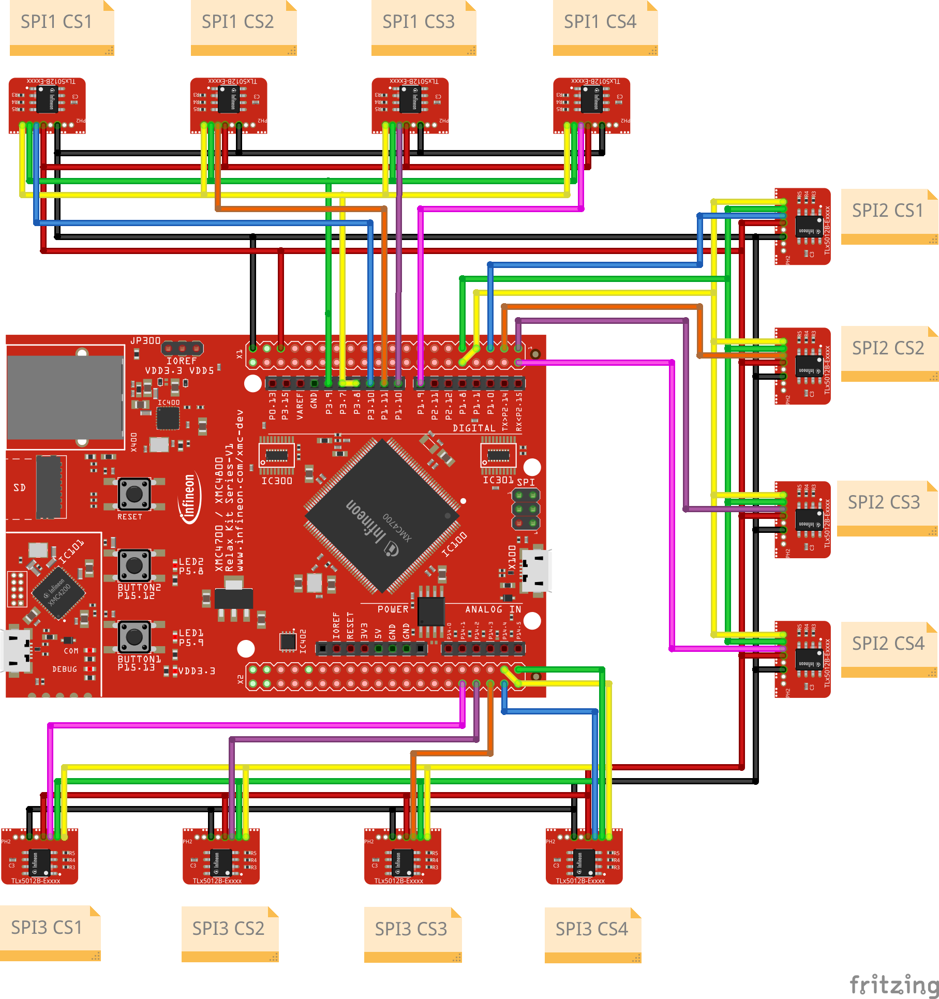
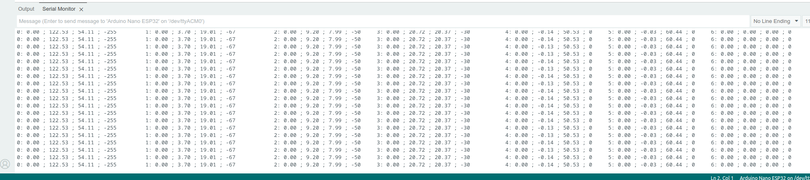

.. _example-useMultipleSPIChannels:

Example to use multiple SPI Channels
-------------------------------------

 This example shows how to use other SPI channels than the default one on the Arduino header. This example is specifically made for the XMC4700 Relax Kit which has five SPI channels.
 From these five channels three can be used with no overlapping of other functionality.

.. note::
   This example is limited to the Infineon XMC4700, but you can use it also for other MCUs with multiple SPI channels. It will not work on MCUs which have only one SPI channel.
   It can work for other MCUs with more than one SPI channel by setting the right pin numbers. 

.. note::
    This example uses SPI1 and SPI2 on the additional X1 and X2 header of the XMC4700. The X1 header is used for the first sensor and the X2 header for the second sensor.
    If the SD card reader and/or the ethernet plug of the XM4700 Relax Kit are not used, two more SPI channels can be used additionally two SPI0, the default one
    on the Arduino header and SPI1 and SPI2. See the `XMC4700 Relax Kit` manual for more information.

Setup
'''''

* Connect the sensor(s) to the hardware platform, select a different SPI channel than the default one.
* Connect the hardware platform to the PC.
* Open the Arduino IDE.
* Open the serial monitor.
* Select the correct serial port.
* Select the correct baud rate (9600).
* Place a magnet close to the sensor to get a valid angle value.

For the hardware setup please use the following image:

Expected Output
''''''''''''''''

* The angle, speed, revolution, range and temperature value of the sensor(s) are read and printed to the serial monitor in every loop iteration.
* It will also print out the values of sensors on different SPI channels.

Additional Information
''''''''''''''''''''''

This example demonstrates how to use the full sensor initialization with the SPI channel selection. This includes the SPI channel as well as the pin
setting for CS, MISO, MOSI, SCK and the slave setting. Therefore this example can be combined with the :ref:`example-useMultipleSensors` to use more 
than one sensor on one SPI channel on one MCU.

Also this example is restricted to the XMC4700 Relax Kit it can be still used on any other MCU with multiple SPI channels or with software SPIs with certain
pin settings. The example shows the angle output from six `XENSIV™ TLx5012B`_ sensors on two different SPI channels.

|

.. _`TLE5012B manual`: https://www.infineon.com/dgdl/Infineon-Angle_Sensor_TLE5012B-UM-v01_02-en-UM-v01_02-EN.pdf?fileId=5546d46146d18cb40146ec2eeae4633b
.. _`XMC4700 Relax Kit`: https://www.infineon.com/cms/en/product/evaluation-boards/kit_xmc47_relax_5v_ad_v1/?redirId=114289
.. _`XENSIV™ TLx5012B`: https://www.infineon.com/cms/en/product/evaluation-boards/tle5012b_e1000_ms2go
