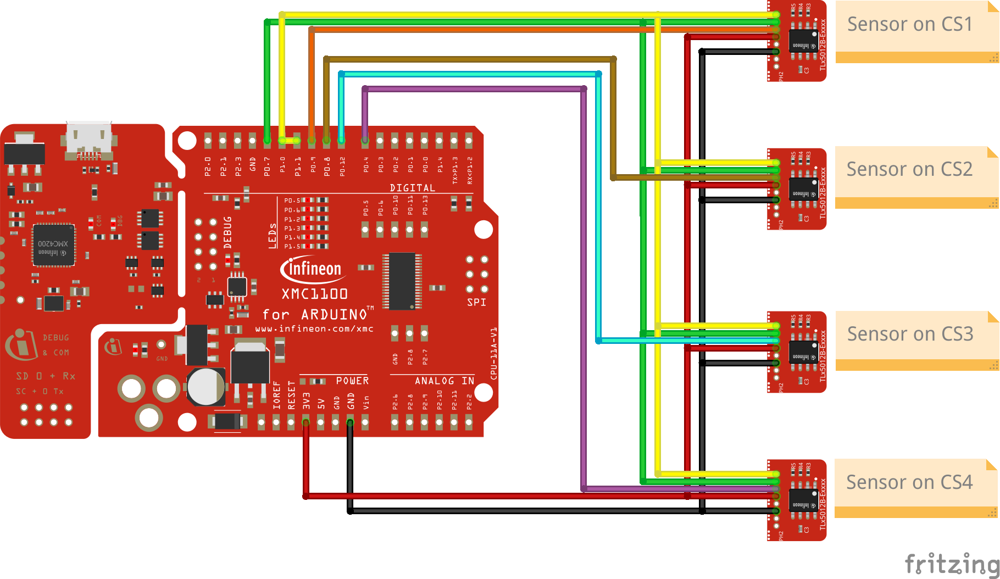
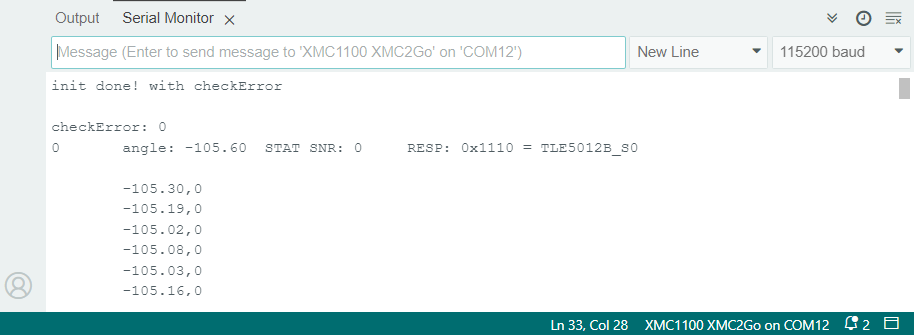

.. _example-useMultipleSensors:

Example to use multiple Sensors
-------------------------------

This example program starts one to four sensors on one SPI line with different CS pins and returns the angle value together with the safety word and the status register SNR.
Due to the selected slave number the SNR will be set to 0x00, 0x01, 0x10 or 0x11. When you fetch a value from the sensor with safety word on, then the safety word register RESP
will indicate the sensor who is responding. This should be the same sensor as you have requested. The loop function will then print out the individual sensor's angle values.

This example also demonstrates how to handle more than one sensor in an array setup. It is not designed for a Kit2Go sensor but for a setup on a normal XMC or Arduino
with up to four sensors on one SPI channel.

Setup
'''''

* Connect the sensor(s) to the hardware platform.
* Connect the hardware platform to the PC.
* Open the Arduino IDE.
* Open the serial monitor.
* Select the correct serial port.
* Select the correct baud rate (115200).
* Place a magnet close to the sensor to get a valid angle value.

For the hardware setup please use the following image:

Expected Output
''''''''''''''''

* The angle value of each sensor together with he SNR register and the resulting slave number will be printed.
* The angle value of each attached sensor will be printed in a loop.

Additional Information
''''''''''''''''''''''

This example shows how to use up to four sensors on one SPI channel. The sensors are addressed by the CS pin and the slave number.
Please set the SENSOR_NUM definition to the number of sensors you want to use (1-4) and the correct CS pin numbers for each of the 
sensors in the sketch.

This example also demonstrates the use of the safety word and the status register SNR and how to read the slave number from the sensor.
The safety word is part of the Infineon's PRO-SIL™ features which are described in the `TLE5012B manual`_.

This example can be combined with the :ref:`example-useMultipleSPIChannels` to use even more than four sensors on one SPI channel.

|

The `XENSIV™ TLx5012B`_ sensors are using Infineon's PRO-SIL™ features which are:

* Test vectors switchable to ADC input (activated via SSC interface).
* Inversion or combination of filter input streams (activated via SSC interface).
* Data transmission check via 8-bit Cyclic Redundancy Check (CRC) for SSC communication and 4-bit CRC nibble for SPC interface.
* Built-in Self-test (BIST) routines for ISM, CORDIC, CCU, ADCs run at startup.
* Two independent active interfaces possible.
* Overvoltage and undervoltage detection.
 
.. _`XENSIV™ TLx5012B`: https://www.infineon.com/cms/en/product/evaluation-boards/tle5012b_e1000_ms2go
.. _`TLE5012B manual`: https://www.infineon.com/dgdl/Infineon-Angle_Sensor_TLE5012B-UM-v01_02-en-UM-v01_02-EN.pdf?fileId=5546d46146d18cb40146ec2eeae4633b
