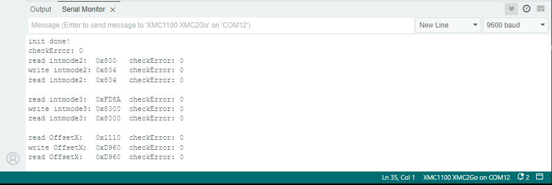

.. _example-writeRegisters:

Example to write Registers
---------------------------

This example shows how to use the register write functions of the sensor, to change certain register bits.

Setup
'''''

* Connect the sensor to the hardware platform.
* Connect the hardware platform to the PC.
* Open the Arduino IDE.
* Open the serial monitor.
* Select the correct serial port.
* Select the correct baud rate (9600).

Expected Output
''''''''''''''''

* The sensor registers are read and printed to the serial monitor.
* The sensor registers are written with new values.
* The sensor registers are read again and printed to the serial monitor.

Additional Information
''''''''''''''''''''''

The TLx5012B uses a DSP with multiple registers for various kinds of data, like angle, angle speed, temperature, etc. or for configuring the sensor
correction functions and interfaces. All of the TLx5012B registers can be read but only some can be written. This example demonstrates how to write to the registers
with their particular methods to write exactly the needed bits. The registers are once read, then written and again read to show the changes.
For more information about the sensor registers and their values see the `TLE5012B manual`_.
Use this example if you want to change the sensor interface settings, or to switch on/off certain filter and correction functions.

|

.. _`TLE5012B manual`: https://www.infineon.com/dgdl/Infineon-Angle_Sensor_TLE5012B-UM-v01_02-en-UM-v01_02-EN.pdf?fileId=5546d46146d18cb40146ec2eeae4633b

