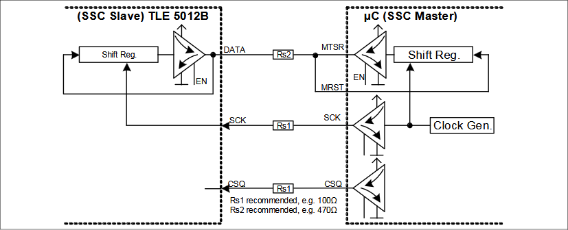
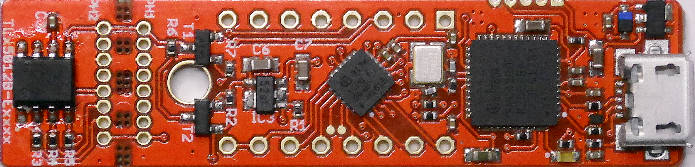
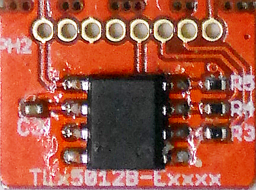
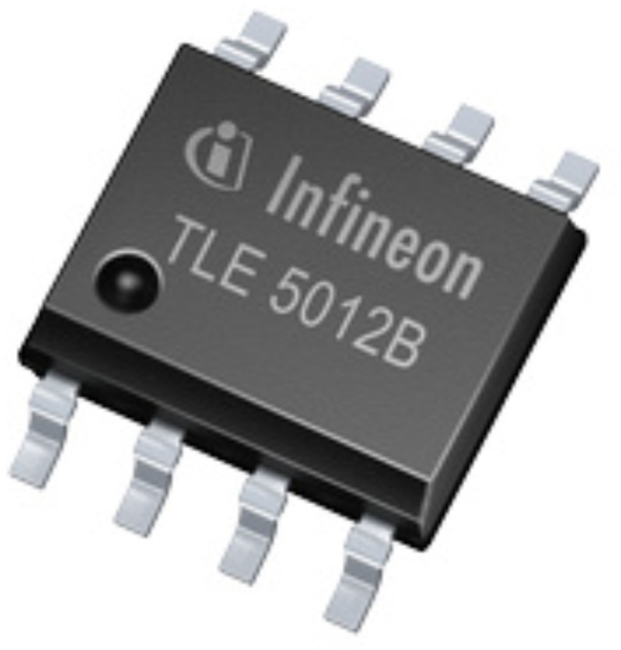
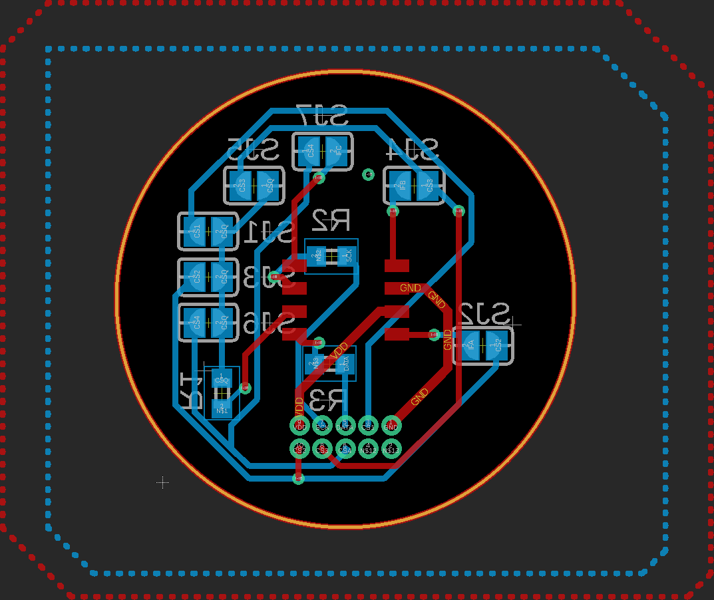

.. _hw-platforms:

Supported Hardware Platforms
============================

The following Infineon products are supported by this library:

* `TLE5012B E1xxx 2GO Kits`_, these are XMC1100 2Go kits with a TLx5012B sensor attached.
* `TLE5012B E1xxx breakout boards`_, these are the small PCBs which are normally attached to the Kit 2Go boards.
* `TLE5012B DSO-8-16 bulk chips`_, these are the bare chips which are used on your own PCBs.

.. note::
    Be aware that each of these types (Kit 2Go, breakout board, bulk chip) can have different predefined communication protocols.
    You can change the protocol via the SSC interface, but it will revert to the default protocol after a reset or power off.

.. note::
    The difference between these types (Kit 2Go, breakout board, bulk chip) are the presence or the absence of the
    resistors and capacitors for the communication protocol. This can influence the required setup for the sensor, especially
    when using with certain MCUs.

.. note::
    This sensor uses a 3-Wire SPI, which means that the two data lines MOSI and MISO are combined to one line using either the Push-Pull 
    or Open-Drain configuration. The 3-Wire protocol is also called SSC (Synchronous Serial Communication) in the sensor datasheet, see in the `TLE5012B manual`_.
    Not all Arduino-compatible boards support the SSC protocol, as they cannot configure the data lines appropriately.
    To address this issue, the library includes specific software stacks that enable the use of the SSC protocol with Arduino.

.. _Interfaces and Variants:

Interfaces and Variants
-----------------------

.. include:: hw-interfaces.md
    :parser: myst_parser.sphinx_

Protocol Configuration
""""""""""""""""""""""

The SSC interface can be configured in two different ways, the Push-Pull configuration and the Open-Drain configuration. The Push-Pull configuration is the default configuration
and is used in the `TLE5012B E1xxx 2GO Kits`_ and the TLE5012B E1xxx breakout boards. The Open-Drain configuration needs a different resistor setup.

Resistor setting for the SSC interface in Push-Pull configuration:

Resistor setting for the SSC interface in Open-Drain configuration:

Power Supply
""""""""""""

The `XENSIV™ TLx5012B`_ family can be supplied with a voltage between 3.3V and 5.5V. The current consumption is around 5mA. The `TLE5012B E1xxx 2GO Kits`_
are supplied via the USB port of the XMC1100 2Go board and are running with 3.3V. The `TLE5012B E1xxx breakout boards`_ and the `TLE5012B DSO-8-16 bulk chips`_
need an external power supply.

.. warning::
    Some MCUs need 5V on Vdd to work properly, you have to test that with your MCU, but be cautious as not all MCUs can handle 5V on 
    their data lines. The sensor is capable of using both, 3.3V - 5.5V, for the SSC interface.
    

TLE5012B Exxxx 2GO Kit
----------------------

The Infineon `TLE5012B E1xxx 2GO Kits`_ are XMC1100 2Go kits with a TLx5012B sensor attached. The sensor is connected to the XMC1100 via the SSC interface
and 3-Wire SPI. Therefore a certain software stack is implemented into the library (see :ref:`file_src_framework_arduino_pal_spi3w-xmc.cpp`) which automatically
detects the right setup.

There is a handy pinout picture for all `TLE5012B E1xxx 2GO Kits`_:

.. _TODO change the pinout picture

.. _TLx5012B Breakout Board:

TLx5012B Breakout Board
-----------------------

The breakout board is the top part of the `TLE5012B E1xxx 2GO Kits`_ and can be used with any Arduino-compatible boards.
It is already equipped with the necessary resistors and capacitors for the SSC interface, including 100 Ohm resistors and 100nF capacitors 
for the chip select (CS) and system clock (SCK) lines. The data line (MOSI/MISO) is connected to the SSC interface of the sensor using a 470 Ohm resistor.
This setup is known as the Push-Pull configuration. The Open-Drain configuration is also possible; refer to :ref:`Interfaces and Variants` for more details.

Also, this still needs some more external resistors to work properly on different MCUs, see the :ref:`arduino-compatible-kits`
Here is the pinout of the breakout board:

.. _TODO change the pinout picture

.. image:: ../img/TLx5012B_Sensor_breakout_pinout.png
    :width: 100%
    :alt: TLE5012B breakout board pinout YET NOT AVAILABLE

|

TLx5012B DSO-8-16 Bulk Chip
---------------------------

The DSO-8-16 bulk chip is the bare chip which is used on your own PCBs. It is the smallest form factor of the TLx5012B family and can be used with any Arduino compatible 
board with the same pin functionalities as the Arduino. So you have to equip your own PCB with the needed resistors and capacitors for the SSC interface, which means 100 Ohm 
resistors and 100nF capacitors for the chipselect (CS) and the system clock (SCK) lines. The data line (MOSI/MISO) is connected to the SSC interface of the sensor with a 470 Ohm resistor.
Also the Open-Drain configuration is possible, therefore see under :ref:`Interfaces and Variants`.

Here is the pin configuration of the DSO-8-16 bulk chip:

.. list-table::
    :header-rows: 1

    * - Pin
      - Function
      - In/Out
      - Description

    * - 1
      - IFC
      - I/O
      - Interface C, External Clock/ IIF Index / HSM Signal 3

    * - 2
      - SCK
      - IDE
      - SSC System Clock

    * - 3
      - CS
      - I
      - SSC Chip Select
    
    * - 4
      - Data
      - I/O
      - SSC Data

    * - 5
      - IFA
      - I/O
      - Interface A, IIF Phase A, HSM Signal 1, PWM/SPC trigger

    * - 6
      - VDD
      - I
      - Supply Voltage

    * - 7
      - GND
      - I
      - Ground

    * - 8
      - IFB
      - O
      - Interface B, IIF Phase B, HSM Signal 2

Reference Design
""""""""""""""""
.. list-table::
    :width: 100%
    :class: borderless

    * - .. image:: ../img/TLx5012b-reference-board-top.png
            :width: 100%
            :align: center

      - .. image:: ../img/TLx5012b-reference-board-bottom.png
            :width: 100%
            :align: center

This reference design is a simple breakout board for the TLx5012B family and is based on the Push-Pull protocol configuration. It is designed to
be used attached to motor or a shaft to measure the angle of the motor or shaft. The board is equipped with the needed resistors and capacitors
and needs only a diametral magnet attached on the shaft. The board only needs to be connected to an Arduino compatible board where MISO/MOSI are
combined to one line and the SCK and CS lines are connected to the SSC interface of the sensor. Shorting the solder bridges SJ1, SJ3, SJ5 or SJ6
allows to select certain lines for different CS settings or by shortening SJ2, SJ4 or SJ7 to use IFA, IFB and IFC instead.

|

This schema can be set onto a small round PCB with a diameter of 25 mm. The board is equipped with a 1.27 mm pitch header to connect to an Arduino compatible board
and to keep the footprint as small as possible. Therefore you can attach this board to a motor or a shaft to measure the angle.

|

.. _`XENSIV™ TLx5012B`: https://www.infineon.com/cms/en/product/evaluation-boards/tle5012b_e1000_ms2go
.. _`TLE5012B E1xxx 2GO Kits`: https://www.infineon.com/cms/en/product/promopages/sensors-2go/#angle-sensor-2go
.. _`TLE5012B E1000 2GO Kit`: https://www.infineon.com/cms/en/product/evaluation-boards/tle5012b_e1000_ms2go/
.. _`TLI5012B E1000 2GO Kit`: https://www.infineon.com/cms/en/product/evaluation-boards/tli5012b_e1000_ms2go/
.. _`TLE5012B E5000 2GO Kit`: https://www.infineon.com/cms/en/product/evaluation-boards/tle5012b_e5000_ms2go/
.. _`TLE5012B E9000 2GO Kit`: https://www.infineon.com/cms/en/product/evaluation-boards/tle5012b_e9000_ms2go/
.. _`TLE5012B manual`: https://www.infineon.com/dgdl/Infineon-Angle_Sensor_TLE5012B-UM-v01_02-en-UM-v01_02-EN.pdf?fileId=5546d46146d18cb40146ec2eeae4633b
.. _`TLE5012B DSO-8-16 bulk chips`: https://www.infineon.com/cms/en/product/sensor/magnetic-sensors/magnetic-position-sensors/angle-sensors/tle5012b-e1000/
.. _`TLE5012B E1xxx breakout boards`: https://www.infineon.com/cms/en/product/promopages/sensors-2go/#angle-sensor-2go