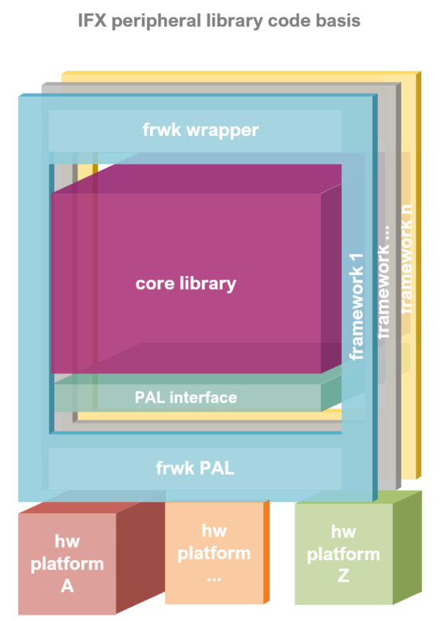

.. _library-architecture:

Library Architecture
--------------------

The `XENSIV™ TLx5012B`_ library follows the architecture pattern shown in the stack diagram:

The monolithic core library can be universally integrated across any low level peripheral 
drivers, embedded operating system, and middleware of each software framework.

The reusability and interoperability is achieved by defining a Platform Abstraction Layer 
(PAL) interface which is implemented by each framework for its specific hardware 
abstraction layer and operating system resources APIs.

Additionally, the core library API is accommodated and adapted to the particularities of 
each software framework. The framework API wrappers intend to harmonize the core 
library API with that of the software development framework in which it is integrated, 
making it easier for the users already familiarized with the development framework.

The support for the multiple hardware platforms is then provided by each development framework.

Core Library
""""""""""""

The core library contains all the library logic and high level functionalities of the 
sensor peripheral. The core library remains C++ agnostic by interacting with the 
specific platform (and framework) through a Platform Abstraction Layer interface. No 
other dependencies than standard C/C++ modules and the PAL are found in these sources.

These include the main functions of the TLx5012B sensor, the sensor configuration and
access to the sensor registers. The standard interface for each sensor is always the SSC
protocol. Other protocols can be used in parallel with the SSC but are not covered by this 
library.

The code sources can be found under "src/corelib".

Platform Abstraction Layer (PAL) Interface
""""""""""""""""""""""""""""""""""""""""""

The Platform Abstraction Layer Interface is implemented via abstract C++ classes 
declaring all the necessary platform resources and functionalities that need to be 
provided by the specific framework-platform implementation.

This includes GPIO and SPI interfaces. The PAL interface is defined in the
"src/pal" folder.

Framework PAL
"""""""""""""

The PAL interfaces is defined for each embedded software framework through its low 
level peripheral drivers and operating system resources APIs. 
The GPIO and SPI interfaces are implemented for each framework in the "src/framework/sample_fmwk/pal" folder.

Due to the 3-wire SPI interface of the TLx5012B sensor certain setups for different
hardware platforms are included here. 

The "src/framework/sample_fmwk/pal" folder contains the pal implementation for 
the particular framework.

Find more information about the supported software development frameworks in 
the Software Frameworks section.

Framework API Wrapper
"""""""""""""""""""""

The idea behind this layer is to adapt the library in order to comply with the 
programming conventions of the integrated programming framework or ecosystem.

Operating system libraries, low level driver of hardware peripherals (digital 
input/outputs, PWM, analog conversion, etc.) or other middleware resources are 
implemented for each development framework following certain patterns for functions, 
parameters, and primitive types.

At this level, certain platform functionalities required by TLx5012B can be already 
defined and adapted to the API available resources: functions prototypes, framework 
core libraries, low level driver HAL, programming patterns, and even framework 
look and feel aspects.

The frameworks wrapper API files are located in the "src/framework/sample_fmwk/wrapper" folders.

Find more information about each software development frameworks API in the 
Software Frameworks section.

.. TODO: Can this section be linked?

Predefined Hardware Platforms
"""""""""""""""""""""""""""""

Given a particular hardware platform and development software framework, most of 
the resources and its configuration can be already determined by default. This 
part of the framework API just defines some pre-configured instances for common 
and officially supported evaluation kits.

These instances are available in the "src/framework/sample_fmwk/wrapper/zzz-platf-xxx.hpp/cpp" source files.

.. _`XENSIV™ TLx5012B`: https://www.infineon.com/cms/en/product/evaluation-boards/tle5012b_e1000_ms2go

