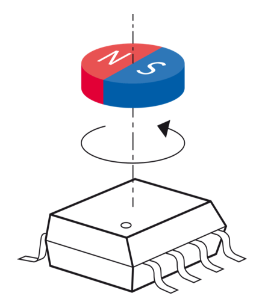
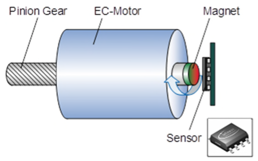

.. toctree::
   :maxdepth: 1

.. _misc:

Additional information
======================

Magnets
=======

The sensor needs a magnetic field to measure the angle. The magnetic field can be generated by a magnet or a magnetic field generator and the magnetic field must be present 
during the measurement. The sensor will detect the magnetic field as soon as there is one and will start to measure the angle value.

Therefore:

* The magnet has to be strong enough to generate a measurable magnetic field. The sensor is not designed to measure the earth's magnetic field.
* The magnet has to be placed close to the sensor to get a valid angle value.
* The magnet has to be placed in a way that the magnetic field is perpendicular to the sensor surface.
* The sensor can detect magnetic fields up to 100mT.
* Use diametrically (as shown in the picture) magnetized magnets to get a homogenous magnetic field.
* For motor shafts use diametrically magnetized ring magnets.
* Place the sensor directly on the motor shaft to get the best possible angle measurement.
* The center of the sensor has to be placed in the center of the magnetic field.
* The sensor is aligned perpendicular to the sides of the chip housing in the center of the chip.

|

The sensor can detect the magnetic field and if there is none, the checkError variable from each routine will be none zero, as the CRC check fails.
But the sensor is also very fault tolerant and can handle a lot of magnetic field disturbances as well as later on placed magnets, so that it 
will detect the magnetic field as soon as there is one and starts to measure the angle value.

Accuracy
========

The accuracy of the angle measurement is depending on the magnetic field strength and the magnetic field homogeneity. Therefore the sensor has to be placed in a way 
that the magnetic field is perpendicular to the sensor surface and the magnetic field is homogenous. A slight tilt or out of center placement of the sensor can lead to
angle measurement errors. Therefore use:

* For motor shafts a diametrically magnetized ring magnet,
* and TLx5012B PCB designs like the reference design to place the sensor as close and exact to the motor shaft center as possible.

Another error factor is the temperature drift of the sensor. The sensor has an internal temperature sensor which is used 
to correct the temperature drift of the sensor and therefore the drift of the angle value. The temperature value is read out with the angle value and 
can be used to correct the angle value. There are functions implemented to correct the angle value with the temperature value.
See the `TLE5012B manual`_ for further information on how and when the temperature drift correction is done.

Sensors which are placed over a long time close to a magnetic field will also show a drift in sensitivity. This lifetime drift can be corrected
by some internal functions. See the `TLE5012B manual`_ for further information on how and when the magnetic field drift correction is done.

There are more correction functions like auto-calibration or prediction of the angle values which all can be used to improve the accuracy of the 
angle measurement. Depending on the predefined sensor interface, these functions are enabled or disabled. See the `TLE5012B manual`_ for further information.

There are more correction functions like auto-calibration or prediction of the angle values which all can be used to improve the accuracy of the 
angle measurement. Depending on the predefined sensor interface, these functions are enabled or disabled. See the `TLE5012B manual`_ for further information.

PRO-SIL™
--------

The `XENSIV™ TLx5012B`_ sensors are using Infineon's PRO-SIL™ features which are:

|

* Test vectors switchable to ADC input (activated via SSC interface).
* Inversion or combination of filter input streams (activated via SSC interface).
* Data transmission check via 8-bit Cyclic Redundancy Check (CRC) for SSC communication and 4-bit CRC nibble for SPC interface.
* Built-in Self-test (BIST) routines for ISM, CORDIC, CCU, ADCs run at startup.
* Two independent active interfaces possible.
* Overvoltage and undervoltage detection.
 
You can use this functionality to check the sensor and the communication with the sensor or to correct fault measurement results either
by drift errors or by read errors. The sensor has implemented self test routines which can be activated. The SIL features are implemented
according to the ISO26262 and ISO61508 standards and can be used in safety critical applications.

Miscellaneous
=============

|

.. _`TLE5012B manual`: https://www.infineon.com/dgdl/Infineon-Angle_Sensor_TLE5012B-UM-v01_02-en-UM-v01_02-EN.pdf?fileId=5546d46146d18cb40146ec2eeae4633b
.. _`XENSIV™ TLx5012B`: https://www.infineon.com/cms/en/product/evaluation-boards/tle5012b_e1000_ms2go
