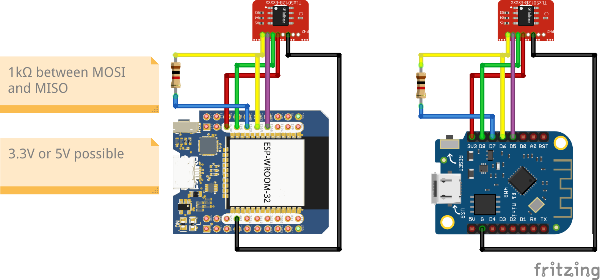

.. _arduino-compatible-kits:

Arduino Compatible Kits
=======================

The `XENSIV™ TLx5012B`_ library is designed to be used with different Arduino compatible hardware platforms using the Arduino IDE or PlatformIO.
It can be easily converted to other platforms by using the provided examples and the `XMC for Arduino`_ library.  The hardware platform needs to 
have at least one SPI channel to communicate with the sensor. Depending on the selected hardware platform, the library will automatically detect the
right setup for the SSC interface. This can be also easily configured by using the provided examples and extended by the user.

The following kits are tested and compatible with this library, but any other Arduino compatible board should work as well.

.. list-table::
    :header-rows: 1

    * - Hardware Platform
      - Type
      - SDK
      - Checked
      - Special Setup

    * - Infineon XMC
      - TLx5012B Kit2Go
      - Arduino IDE | PlatformIO
      - yes
      - no
    * - Infineon XMC
      - XMC1100 Boot Kit
      - Arduino IDE | PlatformIO
      - yes
      - no
    * - Infineon XMC
      - XMC1400 Arduino
      - Arduino IDE
      - yes
      - no
    * - Infineon XMC
      - XMC1400 2Go
      - Arduino IDE
      - yes
      - no
    * - Infineon XMC
      - XMC4200 Platform 2Go
      - Arduino IDE | PlatformIO
      - yes
      - no
    * - Infineon XMC
      - XMC4400 Platform 2Go
      - Arduino IDE | PlatformIO
      - yes
      - no
    * - Infineon XMC
      - XMC4700 Relax Kit
      - Arduino IDE | PlatformIO
      - yes
      - no
    * - Arduino
      - Uno (ATmega)
      - Arduino IDE
      - yes
      - no
    * - Arduino
      - Mega (ATmega)
      - Arduino IDE
      - yes
      - no
    * - Arduino
      - Nano (ATmega)
      - Arduino IDE
      - yes
      - no
    * - Arduino
      - MKR (AT SAMD21)
      - Arduino IDE
      - no
      -
    * - Arduino
      - R3 (ATmega328)
      - Arduino IDE
      - yes
      - no
    * - Arduino
      - R4 
      - Arduino IDE
      - no
      - 
    * - Arduino
      - Nano (ESP32)
      - Arduino IDE
      - no
      -
    * - Arduino
      - Nano (RP2040)
      - Arduino IDE
      - no
      -
    * - RP2040
      - Pico
      - Arduino IDE
      - no
      -
    * - Generic ESP32
      - ESP32 until ESP32-S2
      - Arduino IDE
      - yes
      - yes
    * - Generic EPS8266
      - ESP8266
      - Arduino IDE
      - yes
      - yes

Generic setup for Arduino
-------------------------
If a hardware platform fully supports the Arduino IDE, the library can be used without any special setup. 
The library will automatically detect the right setup for the SSC interface. Only the SPI channel needs to 
be defined in the sketch and for some platforms also the pins which are used by the SPI channel.

Setup for Arduino Uno/Nano/Mega
-------------------------------

The classic Arduino boards with ATmega chips like the Arduino Uno, Nano or Mega are fully supported by the library.
The library will automatically detect the right setup for the SSC interface.
See the following fritzing diagrams for the wiring setup

Special setup for ESP clones
----------------------------

There are many ESP32 and ESP8266 clones available on the market. Some of them are fully compatible with the Arduino IDE, some are not.
The most successful setup is to use a 1kOhm resistor between MISO and MOSI and testing the board first with 3.3V on Vdd and if that does
not work with 5V Vdd. For ESP8266 boards Vdd the 1kOhm resistor and 5V Vdd has to be set always.
In all cases check the pal-pin-types.hpp file for the correct pin mapping. Therefore we have implemented an ALTERNATIVE_PINS macro
which can be set between 0 and 3 for different predefined pin mappings. The default is 0.
You can also always choose the extended sensor initialization and define your own pin mapping.

.. list-table::
    :header-rows: 1

    * - board
      - ALTERNATIVE_PINS
      - extra resistor
      - Vdd
      - pin mapping

    * - Infineon XMC/PSoC boards
      - 0
      - none needed
      - 3.3V / 5V
      - default pin mapping
    * - classic Arduino boards
      - 0
      - none needed
      - 5V
      - default pin mapping
    * - ESP32 clones
      - 1
      - 1kOhm
      - 3.3V
      - special pin mapping
    * - ESP8266, NodeMCU clones
      - 1
      - 1kOhm
      - 5V
      - special pin mapping
    * - ESP32 clones
      - 2
      - 1kOhm
      - 3.3V
      - Arduino pin mapping
    * - experimental
      - 3
      - experimental
      - 3.3V or 5V
      - experimental

Use the following fritzing setups for the wiring setup on ESP32 and ESP8266 clones

The nodeMCU with ESP8266 is a special case. The Vdd of 5V and the 1kOhm resistor between MISO and MOSI is needed
but also the speed of the serial terminal is limited to 115200 baud. This is maybe also true for other ESP8266 boards.
Use the following fritzing setup for the wiring setup on NodeMCU clones:

Arduino R4, MKR and RP2040
--------------------------

This boards are yet not supported.

.. _`XMC for Arduino`: https://github.com/Infineon/XMC-for-Arduino
.. _`XENSIV™ TLx5012B`: https://www.infineon.com/cms/en/product/evaluation-boards/tle5012b_e1000_ms2go
.. _`TLE5012B E1xxx 2GO Kits`: https://www.infineon.com/cms/en/product/promopages/sensors-2go/#angle-sensor-2go
.. _`TLE5012B E1000 2GO Kit`: https://www.infineon.com/cms/en/product/evaluation-boards/tle5012b_e1000_ms2go/
.. _`TLI5012B E1000 2GO Kit`: https://www.infineon.com/cms/en/product/evaluation-boards/tli5012b_e1000_ms2go/
.. _`TLE5012B E5000 2GO Kits`: https://www.infineon.com/cms/en/product/evaluation-boards/tle5012b_e5000_ms2go/
.. _`TLE5012B E9000 2GO Kits`: https://www.infineon.com/cms/en/product/evaluation-boards/tle5012b_e9000_ms2go/
.. _`TLE5012B manual`: https://www.infineon.com/dgdl/Infineon-Angle_Sensor_TLE5012B-UM-v01_02-en-UM-v01_02-EN.pdf?fileId=5546d46146d18cb40146ec2eeae4633b
