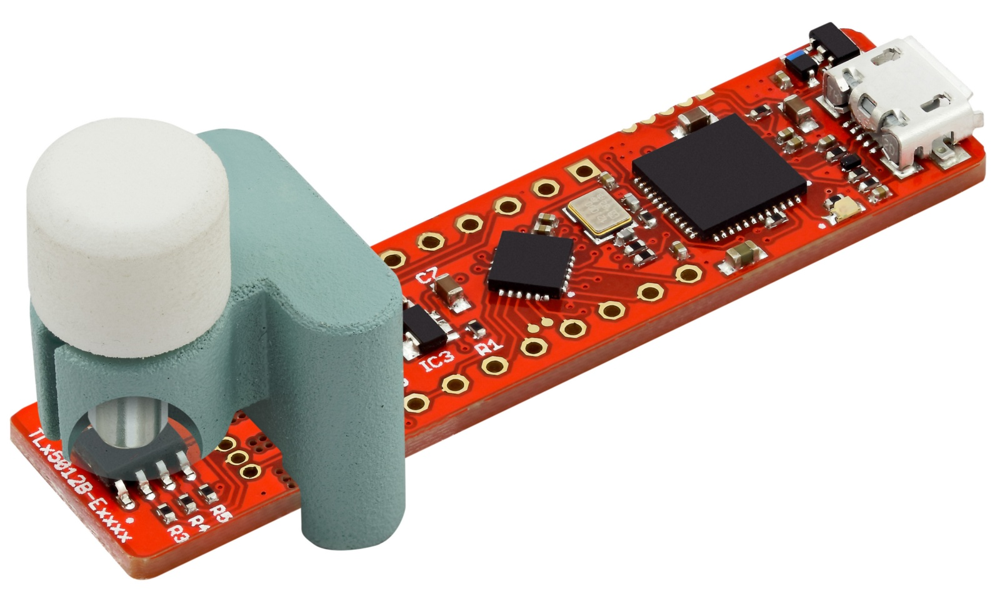

.. _arduino-getting-started:

Arduino Getting Started
=======================

Overview
--------

This getting started guide helps you to properly connect a `XENSIV™ TLx5012B`_ with the right platform and teaches you how to install the required software to use it.

Required Hardware
-----------------

Microcontroller
"""""""""""""""
If you have one of the `TLE5012B E1xxx 2GO Kits`_ than no further hardware is needed as this includes already a XMC1100 2Go board. Please select this board in the Arduino IDE. 

If you have a breakout board or bulk chip, you need an Arduino compatible board with at least one SPI channel.

.. list-table::
    :width: 100%
    :class: borderless

    * - .. image:: ../../img/XMC4700_Relax_Kit.jpg
            :width: 100%
            :align: center
        
        - or

      - .. image:: ../../img/arduino-marked.png
            :width: 100%
            :align: center

Required Software
-----------------

* The `Arduino IDE`_, which can be downloaded `here <https://www.arduino.cc/en/software>`__
* This library installed in the Arduino IDE, the instructions can be found `here <https://www.arduino.cc/en/guide/libraries>`__
* When using an Arduino compatible XMC board, please find installation instructions `here <https://github.com/Infineon/XMC-for-Arduino#installation-instructions>`_.

Tutorial
--------

Software Installation
""""""""""""""""""""""

1. **Install the Arduino IDE**. If you are new to Arduino, please `download <https://www.arduino.cc/en/Main/Software>`__ the program and install it first.

2. **Include the XMC boards in the IDE (if a XMC is used)**. The official Arduino boards are already available in the Arduino IDE, but other third party boards as the Infineon XMC MCU based ones need to be explicitly included. Follow the instructions in the `link <https://github.com/Infineon/XMC-for-Arduino#installation-instructions>`__ to add the XMC board family to the Arduino IDE.

3. **Install the library**. In the Arduino IDE, go to the menu *Sketch -> Include library -> Library Manager*. Type **xensiv tlx5012b** and install the library.

Ready To Go!
""""""""""""

Now you can upload the provided example code to your Arduino compatible board. For this, navigate in your Arduino IDE to *File* -> *Examples* -> *XENSIV TLx5012B Angle Sensor*.
Don't forget that you need a magnetic field to get a valid angle value. You can use a magnet or a magnetic field generator or of course a motor for this purpose.

For a specific description and overview of all examples please refer to :ref:`Arduino examples <arduino-examples>`.

.. _`XENSIV™ TLx5012B`: https://www.infineon.com/cms/en/product/evaluation-boards/tle5012b_e1000_ms2go
.. _`TLE5012B E1xxx 2GO Kits`: https://www.infineon.com/cms/en/product/promopages/sensors-2go/#angle-sensor-2go
.. _`TLE5012B E1000 2GO Kit`: https://www.infineon.com/cms/en/product/evaluation-boards/tle5012b_e1000_ms2go/
.. _`TLI5012B E1000 2GO Kit`: https://www.infineon.com/cms/en/product/evaluation-boards/tli5012b_e1000_ms2go/
.. _`TLE5012B E5000 2GO Kits`: https://www.infineon.com/cms/en/product/evaluation-boards/tle5012b_e5000_ms2go/
.. _`TLE5012B E9000 2GO Kits`: https://www.infineon.com/cms/en/product/evaluation-boards/tle5012b_e9000_ms2go/
.. _`TLE5012B manual`: https://www.infineon.com/dgdl/Infineon-Angle_Sensor_TLE5012B-UM-v01_02-en-UM-v01_02-EN.pdf?fileId=5546d46146d18cb40146ec2eeae4633b
.. _`Arduino IDE`: https://www.arduino.cc/en/software
.. _`XMC1100 Boot Kit`: https://www.infineon.com/cms/en/product/evaluation-boards/kit_xmc_2go_xmc1100_boot_kit/
.. _`XMC1100 2Go`: https://www.infineon.com/cms/en/product/evaluation-boards/kit_xmc_2go_xmc1100/
.. _`XMC for Arduino`: https://github.com/Infineon/XMC-for-Arduino
