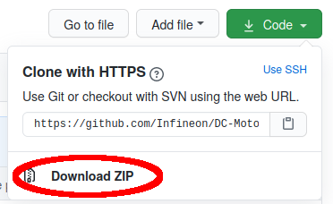

.. _arduino-lib-installation:

Arduino Library Installation
============================

Installation Methods
--------------------

The library can be installed in several ways:

* Arduino IDE library manager
* Arduino IDE import .zip library
* Arduino IDE manual installation
* PlatformIO

These installation processes are conveniently described on the official `Arduino`_ website.

* **Arduino IDE Library Manager**

Library name: ``XENSIV TLx5012B Angle Sensor``

* **Arduino IDE Manual Installation**

Download the desired .zip library version from the repository `releases`_ section. 

.. warning::
    As a general recommendation, downloading directly from the master branch should be avoided. 
    Even though it should not, it could contain incomplete or faulty code.

* **PlatformIO**

Refer to the section :ref:`PlatformIO <arduino-platformio>` and the `official website`_.

.. note::
    PlatformIO is a professional collaborative platform for embedded development. It is an alternative to the Arduino IDE and is compatible with the Arduino ecosystem.
    PlatformIO is not officially supported by Infineon Technologies AG.

.. _releases: https://github.com/Infineon/arduino-xensiv-tlx5012b-angle-sensor
.. _official website: https://docs.platformio.org/en/latest/librarymanager/quickstart.html
.. _Arduino: https://www.arduino.cc/en/guide/libraries
